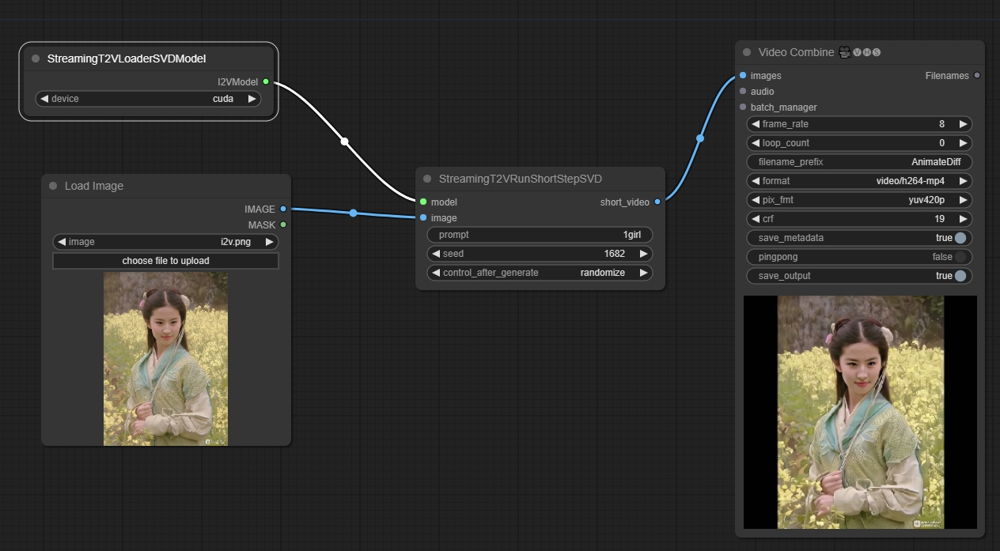
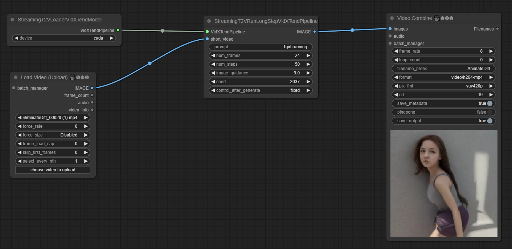
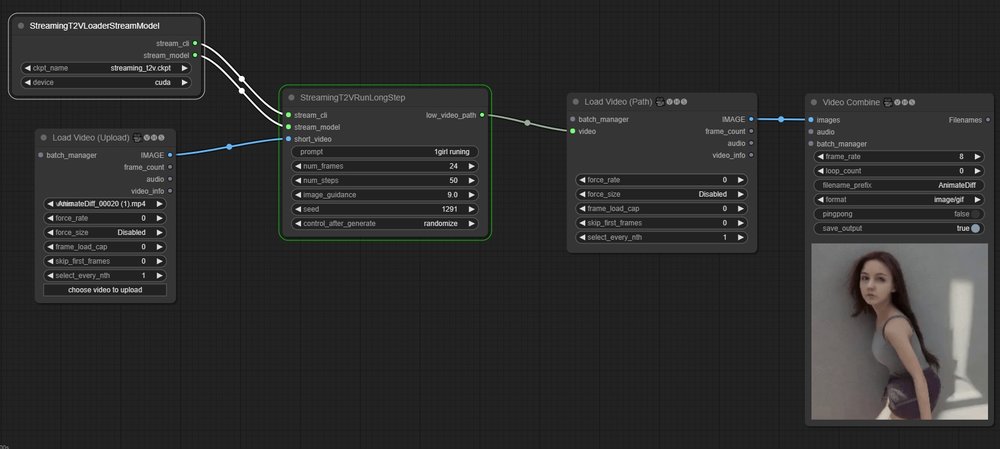
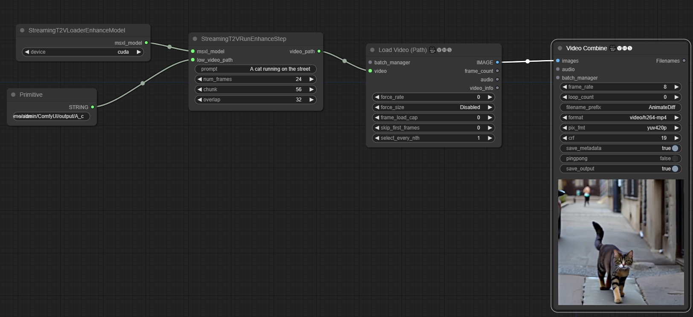
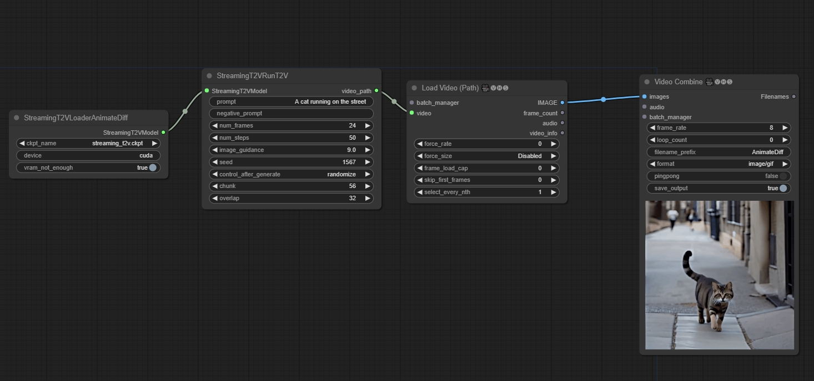

# ComfyUI-StreamingT2V

Painebenjamin created the [VidXTend](https://huggingface.co/benjamin-paine/vidxtend) model, which reduces the size from the original 25.6GB to 5GB. When using the VidXTend process, there is no need to manually download the model, as it will be downloaded automatically.

If you use the original model, please download the [StreamingT2V model](https://huggingface.co/PAIR/StreamingT2V/blob/main/streaming_t2v.ckpt) and place it in folder `ComfyUI/model/checkpoints`

VidXTend (<10G VRAM) | Original (<15G VRAM)

## workflow

### Step 1 (It's not necessary.) Generate short video (16x256x256):

You can freely generate a 16x256x256 video without using the process below. You can even use videos downloaded from the internet.

AnimateDiff Option: https://github.com/chaojie/ComfyUI_StreamingT2V/blob/main/wf_short_ad.json

Modelscope Option: https://github.com/chaojie/ComfyUI_StreamingT2V/blob/main/wf_short_ms.json

SVD Option: https://github.com/chaojie/ComfyUI_StreamingT2V/blob/main/wf_short_svd.json

### Step 2 Generate long video (nx256x256):

VidXTend Option: https://github.com/chaojie/ComfyUI_StreamingT2V/blob/main/wf_VidXTend.json

Original Option: https://github.com/chaojie/ComfyUI_StreamingT2V/blob/main/wf_long.json

### Step 3 Generate long enhanced video (nx512x512):

https://github.com/chaojie/ComfyUI_StreamingT2V/blob/main/wf_enhance.json

### You can generate all by one workflow (MORE VRAM)

ModelscopeT2V (T2V)

https://github.com/chaojie/ComfyUI_StreamingT2V/blob/main/wf.json

AnimateDiff (T2V)

https://github.com/chaojie/ComfyUI_StreamingT2V/blob/main/wf_ad.json

SVD (I2V)

https://github.com/chaojie/ComfyUI_StreamingT2V/blob/main/wf_svd.json

## [StreamingT2V](https://github.com/Picsart-AI-Research/StreamingT2V)